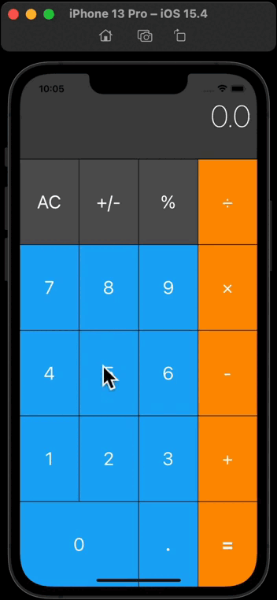

### CalculatorArt

Hello there, I've created a basic Calculator app using the UIKit and Foundation.

 

I create a basic calculator that supports the following functionality:

- Only basic math will be supported: +, -, *, /
- Numbers can be positive or negative.
- Decimal values will also be supported.

### What skills I learned:

- build an app with Storyboard
- use and understand auto layout and constraints
- use and understand the target-action design pattern
- use and understand the coordinate gird system
- use and understand the stack data structure
